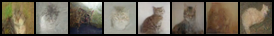
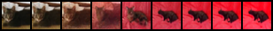

# ddpm_cat

このリポジトリは CIFAR-10 の `cat` クラスに対して Denoising Diffusion Probabilistic Model（DDPM）を学習し、画像生成と潜在補間を行うサンプルです。

## 1. 環境構築

前提:
- `uv` がインストール済み
- Python 3.13 が利用可能

セットアップ:

```bash
cd src/ddpm_cat
uv sync
```

## 2. 学習

```bash
uv run python train.py
```

出力:
- `src/ddpm_cat/ddpm.pth` (学習済みモデル)

## 3. 生成

```bash
uv run python gen.py
```

出力:
- `src/ddpm_cat/sample.png`

サンプル画像:



## 4. 補間

```bash
uv run python interpolate.py
```

出力:
- `src/ddpm_cat/interp.png`

サンプル画像:


